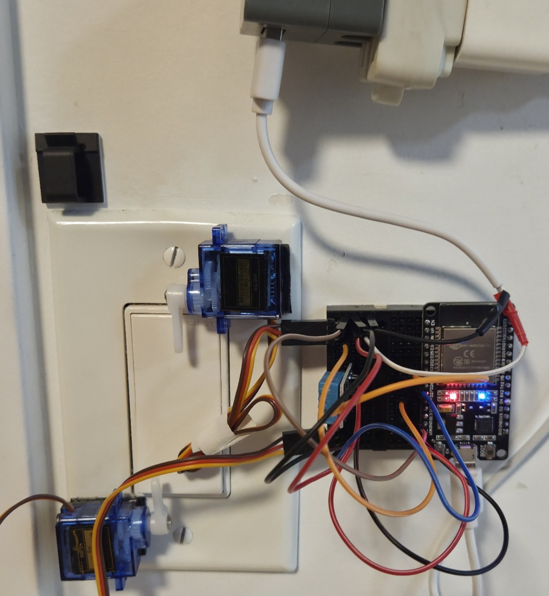
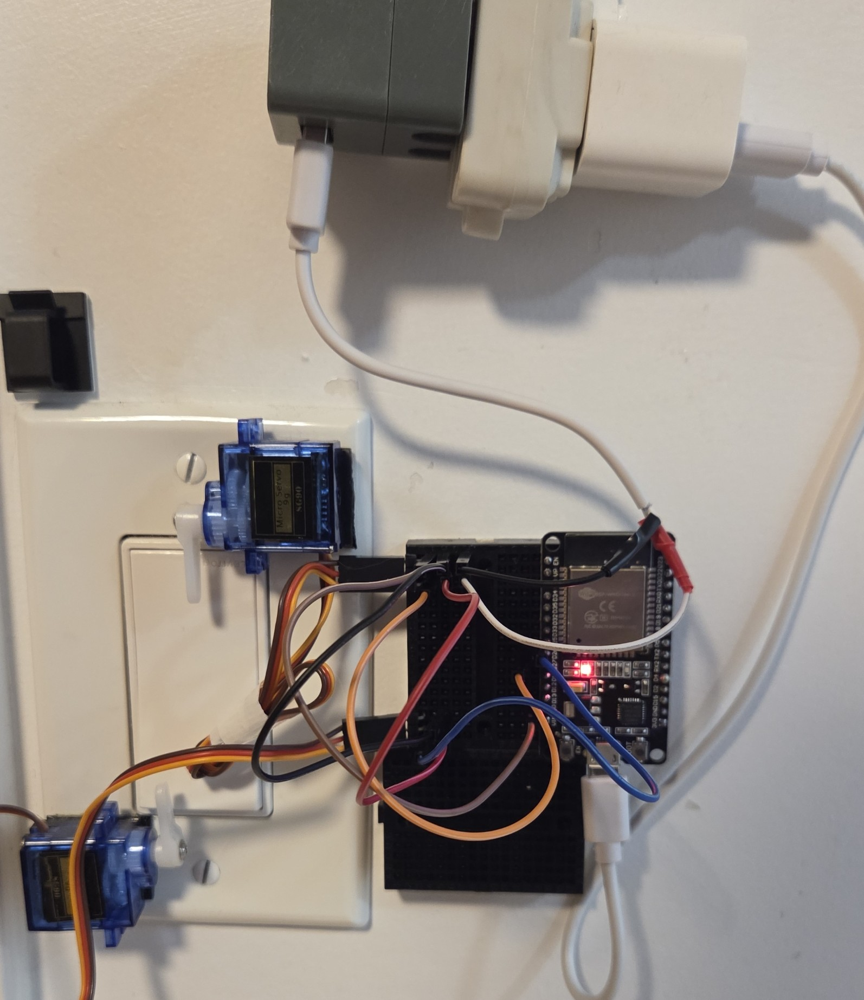
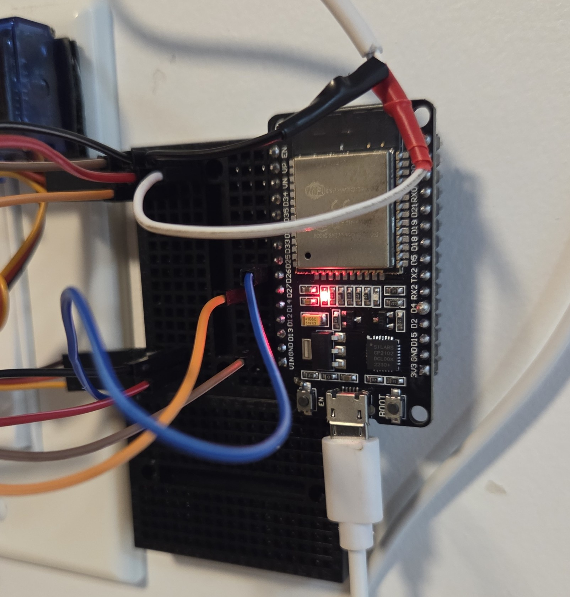

# Automated Toggle Switch Light

I rent my place, so I didn’t want to cut into the walls or replace switches. But I still wanted to control my overhead light with Google Home. The overhead fixture is a built-in LED panel, so I couldn’t just swap the bulb for a smart one. Other smart options (like inline relays or smart wall switches) required electrical work I didn’t want to risk in a rental.

So I built a removable, “servo-actuated switch presser “robot finger” that presses the light switch for me. It’s cheap, uses parts I already had, and can be removed without damage. I also added a DHT11 temperature and humidity sensor just for fun. It's not exactly pretty but it works!

---

## Supplies

1. Microcontroller that has WiFi capability and is compatible with Arduino Cloud (ESP32 C6 is not, for example)
   * I used the ESP32 Devkit V1 [Amazon ($11.99 CAD)](https://www.amazon.ca/Haosie-Module-Development-Wireless-ESP32-D0WDQ6/dp/B0CQQ5T8J9/ref=sr_1_10?crid=M0H6OHR1QIV6&dib=eyJ2IjoiMSJ9.cok-XVsK4jczXbLD-D6rJsXbtfY8D3a34cPqD3lXwKQMTnhiVHH-xt7VPxKu7OL4S5NlbF7RoYNVWrScQ8dCR1AVIAOOGhqVayoayLArgj76z_tif9xxT7fiCgNDsaOW13Z_Cm6YzI5ZzhI-8W41WaWRD4uNn70_p7kTiAQhIwdhotrkmjt27UM0ujJrEYDT2Xc8CRoqFY0loU1loqp7yn3Ij2THxjU5w1OP8kxARR1BdJ3F87GenTHJiMhHaNoRtgCMF0GDd3ttsYfh4RTMkj3XM8MTtPoYrKPoWapSJwI.RT13kyvV9jfHqnORreH7lwPGg_3iAsbJ4IIJZ8Efjpk&dib_tag=se&keywords=esp+wroom+32&qid=1758574437&refinements=p_36%3A-1500&rnid=12035759011&sprefix=esp+wroom+32%2Caps%2C154&sr=8-10)

2. 2 micro-servos
   * I used SG90s [Amazon 5 for $13.99](https://www.amazon.ca/Motors-Helicopter-Standard-Steering-Control/dp/B0CXXPFNMF/ref=sr_1_10?crid=2LS8I6WJHF3ID&dib=eyJ2IjoiMSJ9.KPKEM935jJOwk0fBEGqDVvbfFEMavR3DMHqLtlR-o6rSt88Nax2skVouk-NBqkm-k_P2yqirT_9ZRG5dfLVFSC8ZE9X9fViUfcATZ9kfxxA3Lgi0a8haFsX5Zx7pSO3EiTjvZH4YKk_Ma5VwOduhv9gGHzBXdRxS070WZi2iINBSur8fVEEbOffMdQRkg880H5yokNM0yDIvNqFu2CIH4Q34ksT7geVS1qwQuKtnLaupxnfZ2HgMF9bJ1XcPNABQ34AaB5F5_-l-DKZMphj-6jhNtTHj19aIMiVwop5gulg.g6N3jAAPRIMGWdB8p7B_eLUy5Yxw37iUxNu2WySGP00&dib_tag=se&keywords=sg90&qid=1758574647&sprefix=sg90%2Caps%2C164&sr=8-10)
3. 1 breadboard
   * [Amazon ($2.71)](https://www.amazon.ca/Taidacent-Solderless-Breadboard-Experimental-Platform/dp/B081YTVYRR/ref=sr_1_13?crid=186V5BCQ7IDZW&dib=eyJ2IjoiMSJ9.z7xYv5zE7iZ1GB2---gwXG_oFkXAiYfTr5aQueFh8jidZj-b_TANBAYX4Erdnoe6MY0W3vUc7plSTypFxCBAXQ46ILe-iNfsjgP9pPdnk65Qq8g1b7C2OiHd_2-WTHUPOCC7PcpJhgKMOIC0Uzhf5uk1zbEhSl7wBzdp7P_wojOu4LOv6hkyKwP3t7GR9seDW40YHqbc5k1FQVzQakt0rx64vwIeubh424XvF9lJgZD0NnpAyBzdi9dm6wvzbvO9mtjh8Y3UivFzkVZE0iL4w8bTaCtw-u4rcMSaoNQXyTc.eFIQ2CBx1UVANjVl3_Ws-dWe7hVxR3YMtiLO5sYwGY8&dib_tag=se&keywords=mini+breadboard&qid=1758574992&refinements=p_36%3A-800&rnid=12035759011&sprefix=mini+breadboard%2Caps%2C142&sr=8-13)
4. Male to Male and Female to Male jumper wires
   * [Amazon ($5.99)](https://www.amazon.ca/Generic-Multi-colored-Breadboard-Jumper-Female/dp/B0BYZDK16X/ref=sr_1_6?crid=3U3JPGWPTXESY&dib=eyJ2IjoiMSJ9.arURaQwUmGF_DmWSn0grjMRIKJxWrZQBvQ-fhksJ0qtebIMDstIT9GYbgMo1QwcnxqJGt0MZiki1wlICRTDOtaM_zGdSdrPenXF3mxaCdgG2mIeYtINnoXu2vhMvX0rPAdV2W_-PmT3wkg__G8mAH2wgz9_-3eOUhWAmFziAzLsR4fAprmgapVFcAD72s8tZp2boOcYtGcErG53sT11tUgtbJDlEu9TltWgMjOyVk-qnpQAE758wi52KpO7UYe5AiPkZBah3gNa2fwFbjg6n8wMcNdIIKHDRjHgDzlS-DkM.oZ529prrBpGcsjpr3Opaj5QK957YmI4Uc72FdR2qLbM&dib_tag=se&keywords=female+to+male+and+male+to+male+jumper+wires&qid=1758575127&refinements=p_36%3A-800&rnid=12035759011&sprefix=female+to+male+and+male+to+male%2Caps%2C177&sr=8-6)
5. Old USB C cable (free)
   * If you're going to buy one then you're better off just buying a USB to male header [Amazon ($10.99)](https://www.amazon.ca/DKARDU-Motherboard-Extender-Adapter-Converter/dp/B0C14LD753/ref=sr_1_19?crid=3Q4RMJKXMDWDY&dib=eyJ2IjoiMSJ9.20wRrIHTC9YCEQ5YZO7-mee-7V-t-SgRW0H2QAfqqp3_NH12fer6Y4tZLmkrx7w3MHn9zbgEq8V0bnupHbILSNRbDx7HyNCEr3GFamKAyMPvYcs1amACgfuRTMWV9kBlMuB1RlrbsquCArtWxQuV6m-VapqzbVNnhzjX_05PbRfZKBoFGdd6Q5X-YYF69RbNSJAz5QiLFHwCUSKl1QaPFRa0lke4lxqeUzTp5Nwcgl85EwLAQRma5LseH2_Bpsmz98Y7PgVFzo80EaC6VugmP1bg18OCsF28edVTGOw8q0Q.2UDeZIiyz50J_CditbVnnUHFCPw4hr5JtZvE4G_6MW0&dib_tag=se&keywords=usb+to+breadboard+wire&qid=1758575271&sprefix=usb+to+breadb%2Caps%2C178&sr=8-19)

---

## Physical Setup

### Servo Mounting

I used **SG90 micro-servos**. They come with plastic “horns” (arms) you can screw onto the shaft.

For mounting:

* You can 3D print a bracket if you want something clean.
* I went low-tech: heavy-duty wall-mount Velcro strips. A dab of glue between the Velcro pieces helped hold against servo torque.

---

### Wiring

#### Powering the Servos

* Each SG90 servo needs \~200-250 mA (up to \~360 mA peak). Two can pull close to 1 A.
* The ESP32 can’t provide this from its 3.3 V or 5 V pins. If you try, the board will brown out (temporarily shut down due to low voltage) or reset. I've found that they may work for a few uses, but they always eventually start whining, because of lack of power, instead of moving.
* Solution: use an external 5 V supply. I used an old USB-C phone charger cable (5 V, 2–3 A).

> 💡 Tip: Beginners may find it easier to buy a “USB breakout board” or “5 V wall adapter with screw terminals” instead of splicing wires.

If you do splice a USB cable:

1. Cut off the device end. Strip back the insulation until you find two main wires (sometimes red/black, sometimes other colors). If there are more than 2 wires, it's likely you used a data-capable charger. This is fine you'll just have to test the wires to see which 2 are ground and power. Then tape off the remaining wires.
2. Plug the USB end into a power source and use a multimeter to check which is 5 V and which is GND.

   * Set the multimeter to 20v
   * If the meter reads **+5 V**, the wire on the black probe is ground.
   * If it reads **-5 V**, swap the probes.
3. Connect these to jumper wires for breadboard use.
    
    * Strip a jumper wire with a male end. Twist the jumper wire copper up with the USB ground copper then wrap with electrical tape to prevent shorts.
    * Do the same for the power wire
    * Obviously, if you have a soldering iron then soldering the wires is an even better solution
> ⚠️ Never leave exposed wires uninsulated!

#### Final Connections

1. Plug the external 5 V and GND into your breadboard rails.
2. Connect both servos’ red wires to 5 V and both brown/black wires to GND.
3. Connect the external **GND** to the ESP32 **GND**. This shared ground is essential for the servo signal to be understood. The servo compares the signal voltage to its own ground to know how much to turn by. So the signal pin and the servo need to have the same ground so that they have the same reference point. 
4. Connect the servos’ signal wires (orange usually) to your chosen ESP32 pins. (I used GPIO 26 and 27.)
5. If using a DHT11 sensor:

   * Connect its VCC to **3.3 V** or **5V** on the ESP32.
   * Data pin to GPIO 33 (or another free pin).
   * GND to GND.
   

---

## Programming Setup

1. **Connect ESP32 to Arduino Cloud**

   * Plug the ESP32 into your computer using a USB cable that supports data (not just charging).
   * Go to [Arduino Cloud](https://cloud.arduino.cc), log in, and add a new device.
   * My board is an **ESP-WROOM-32 DevKit V1**, so I chose **ESP32-WROOM-DA Module** from the compatible list.
   * Follow the prompts to create a new *Thing*, entering your Wi-Fi name, password, and the Secret Key that Arduino Cloud gives you.

2. **Set up Google Home variables**

   * Under your Thing, add a cloud variable named `Light`.
   * Choose **Google → Light** as the type.
   * Set it to **Read & Write** and **On Change**.
   * (Optional) Add `Temperature` and `Humidity` if you’re using a DHT11 sensor. Note: Arduino Cloud doesn’t have a “humidity” type for Google Home, so I just used the **CloudTemperatureSensor** type for both. Mark these as **Read Only** and **Periodic**.

3. **Load the code**

   * Copy the `automatic-light.ino` sketch into your Thing’s sketch file.
   * Remove the temperature/humidity parts if you don’t have a sensor.
   * Update the pin numbers to match your wiring.

4. **Tune the servos**

   * You’ll need to experiment with servo angles to get reliable switch presses.
   * Too little rotation → the switch doesn’t click.
   * Too much → the servo pushes itself loose or strains.

5. **Connect to Google Home**

    * Go to Google Home on your preferred device
    * Devices -> Add -> Works with Google Home -> Arduino -> Connect Account
    * Finally you can choose to add the Light (and Temperature and Humidity) to a room. 
